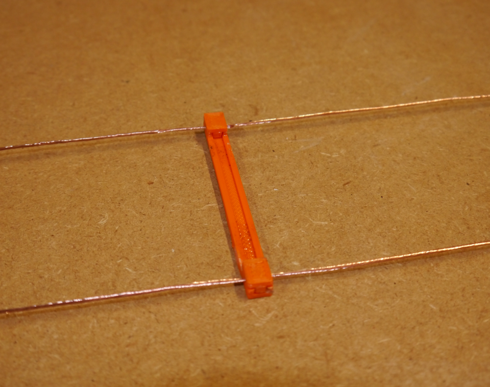

# Open-Wire Transmission Line Construction with 3D-Printed Spacers

This project describes the construction of homemade open-wire transmission line, along with some performance measurements.

I constructed two variants, one using an insulated 14 AWG antenna wire, and another using inexpensive 18 AWG bare stranded wire available at Home Depot and other retailers.

STL files for the 3D-printed spacers and the corresponding SolidWorks models are included.

An important caveat:  as of this writing (Sep 2024) I've constructed initial lengths of these feedlines,
but they haven't yet been exposed for any significant length of time to UV light and the effects of weather, 
so long-term reliability is yet to be proven.  
I'll update this page in the future as data becomes available.

## Description

I needed a length of open-wire transmission line to feed a multi-band doublet antenna, and commercially-available options are scarce or non-existent.
I had purchased a 500 ft spool of antenna wire (`DX Engineering DXE-ANTW-500`) for the antenna itself and decided to construct the feedline from the same material.
This is a 14 AWG stranded wire with a UV-resistant PVC jacket.

It appears that this wire is now only available in smaller spools (300, 150, 75 feet).
Some other wire with the same jacket diameter (0.115") would presumably work just as well.

I decided on a wire spacing of 3 inches, with spacers placed every 18 inches, purely for mechanical (or aesthetic?) reasons.
The wire spacing isn't very significant electrically -- practical values all result in characteristic impedancess in the 500 - 600 ohm range.

The spacers are printed from ASA filament, which is similar to ABS but known for its superior UV resistance.  
Some domestic filament manufacturers I've purchased the ASA filament from are [Coex](https://coex3d.com/) and [3DXTech](https://www.3dxtech.com/).
I've included versions which can be assembled using acetone as a solvent,  as well as a version that uses cable ties to attach the wires.

 

After completing the first version, I decided to produce a second version using bare wire, both to see what effect the insulation has on performance, 
and to try to achieve the lowest-possible materials cost.

After surveying the available sources of bare stranded wire (there are surprisingly few, as it turns out), I came across `Cerrowire 18 AWG Stranded Bare Copper Grounding Wire`
 ($17.87 / 250 ft) at Home Depot.  At $0.07 / ft, it's considerably cheaper than the antenna wire used in the first design (around $0.32 / ft as of late 2024). 
 It's possible to find 14 AWG bare stranded wire for around $0.17 if you need the larger gauge.

## Models

The 3D models provided in the `\models` directory are:

For the insulated-wire version:
| | File | Desc |
| :---: | --- | --- |
| 1 | Spreader_3inch_4a.* | 3 inch spreader (for welding with acetone) |
| 2 | Spreader_3inch_4a_1hole.* | ...same, with (1) mounting hole |
| 3 | Spreader_3inch_4a_2hole.* | ...same, with (2) mounting holes |
| 4 | Spreader_3inch_4b.* | Wire clips for above parts (2 per spreader) |
| 5 | Spreader_3inch_6.* | Version for assembly with wire ties |

 For the bare-wire version:
| | File | Desc |
| :---: | --- | --- |
| 1 | Spreader_3inch_18AWG.STL | 3 inch spreader (for welding with acetone) |
| 2 | Spreader_variable_18AWG.SLDPRT | Solidworks model (supports variable wire spacing) |
| 3 | Spreader_18AWG_Clip_3.* | Wire clips for above parts (2 per spreader) |

 Material cost per spacer is approximately $0.08.

## Assembly

The wire clips attach the wires to the spacer as shown above.  As produced on my printer, the clips snap firmly onto the spacers.
If this isn't the case for your equipment, most (all?) 3D printing software will allow you to scale the model to be printed, allowing you
to obtain a tight fit.

I began by attaching the two wires to the center insulator I'll be using for the antenna, and stretching them tight using a bungie cord at the other end.

Press the spacer onto the wires and apply a generous amount of acetone to all the mating surfaces before inserting the clips.
I used some cheap spring clamps (Harbor Freight, etc.) to hold things in place for a few minutes.

After an hour or so the parts will have formed an extremely strong bond. The examples I've tested are impossible to pull apart manually.
The only problems I experienced were, I think, the result of being too stingy with the acetone.

I've also included a spacer for use with wire ties (the ones I used are 2.5 x 98mm).

 
The bare-wire versions are assembled in the same way:
 
 

## Performance

I suspended approximately-66-foot-long sections of the two transmission lines in my workshop, without bends and separated by several feet from other objects, 
and performed various measurements:

### Velocity factor

**For the bare-wire TL:**

Using my VNA and a balun, I observed the frequencies of the nulls that appear at odd multiples of a quarter wavelength (with the far end open):

| Freq (MHz) | WL | Implied electrical length (ft) |
| --- | --- | --- |
| 3.65 | 1/4 $\lambda$ | 67.368 |
| 11.02 | 3/4 $\lambda$ | 66.940 |
| 18.40 | 5/4 $\lambda$ | 66.819 |
| 25.78 | 7/4 $\lambda$ | 66.767 |

The average of these values is 66.974, and the physical length of the line is 66.25 ft, resulting in a velocity factor of $VF = 66.25 / 66.974 = 0.9892$ 
and an effective dielectric constant of $\epsilon$r $= 1/VF^2 = 1.022$

**For the insulated-wire TL:**

In this case I shorted the far end and recorded the nulls at multiples of 1/2 $\lambda$, for example:

| Freq (MHz) | WL | Implied electrical length (ft) |
| --- | --- | --- |
| 7.195 | 1/2 $\lambda$ | 68.351 |
| 14.3104 | 2/2 $\lambda$ | 68.73 |
| 21.3609 | 3/2 $\lambda$ | 69.068 |

The average of these values, and a few more not listed here, is 68.913, and the physical length of the line is 65.58 ft, resulting in a velocity factor of $VF = 65.58 / 68.913 = 0.9516$ 
and an effective dielectric constant of $\epsilon$r $= 1/VF^2 = 1.104$

 

### Characteristic impedance

**For the insulated-wire TL:**

Using the equation for $Z_o$ in free space, neglecting the presence of the insulation and spacers:

$Z_o = 119.92 cosh^{-1}(3 / 0.0641) = 544.3 \Omega$   &emsp; &emsp;&emsp;  14AWG wire, 3" spacing

The formula $Z_0 = \sqrt{Z_{IN(short)} * Z_{IN(open)}}$ calculates $Z_0$ using input impedance measurements of the line with the far end shorted and open, respectively.\
My measurements at various frequencies resulted in:
| Freq (MHz) | $Z_0 (\Omega)$ |
| --- | --- |
| 1.7847 | 513.7 |
| 5.3542 | 512.6 |
| 8.9296 | 516.0 |
| 12.4873 | 513.0 |

Taking the average as 513.8 $\Omega$, we can re-calculate $\epsilon_r$ as\
    $\epsilon_r = (544.3 / 513.8)^2 = 1.122$\
which seems reasonably close to our previous calculation.

**For the bare-wire TL:**

$Z_o = 119.92 cosh^{-1}(3 / 0.0403) = 599.97 \Omega$ &emsp; &emsp;&emsp;          18AWG wire, 3" spacing

| Freq (MHz) | $Z_0 (\Omega)$ |
| --- | --- |
| 1.836 | 586.1 |
| 5.507 | 586.4 |
| 9.179 | 587.2 |

Mean $Z_o = 586.5 \Omega$ \
$\epsilon_r = (599.97 / 586.5)^2 = 1.0465$

 

### Loss

For comparison purposes, I went back to old editions of the `ARRL Antenna Book` to find data on the attenuation of various parallel-conductor transmission lines.

As an aside, the [HathiTrust](https://www.hathitrust.org/) web site allows you to access (legally) at least a couple of old-timey editions of the Antenna Book:

[ARRL Antenna Book (1955 ed.)](https://babel.hathitrust.org/cgi/pt?id=coo.31924004658088)\
[ARRL Antenna Book (1949 ed.)](https://babel.hathitrust.org/cgi/pt?id=wu.89088894241)

(description of test setup to be added...)

The following graph summarizes the attenuation of:
* the transmission lines ("Insulated", "Bare") described in this project
* open-wire line, bare 12AWG conductors (from ARRL Antenna Book, 1955 ed.)
* 14-076 transmitting-type tubular twin lead (from ARRL Antenna Book, 1955 ed.)
* DXE-400MAX coaxial cable
 
 
 

 
 

The results for my bare-wire TL exactly coincided (implausibly?) with the ARRL Antenna Book's values for open-wire line. \
Just a coincidence...my 18AWG line should be a little lossier than their 12AWG line. This probably reflects
some limitation in my test setup (or skills).

The general trends depicted seem reasonable, though: the 14AWG insulated version is slightly less lossy at lower frequencies,
but suffers relative to the bare 18AWG version at higher frequencies as dielectric losses become more significant.

The Python code for generationg this graph can be found in the `\code` directory.

## Conclusion
The transmission line design described here is quick and easy to construct, at a modest price.\
I have hopes that it will prove to be reliable in the face of long-term exposure to weather and UV radiation, 
although this remains to be seen.

bare coppper weathering?

## Disclaimer
You access to and use the contents of this site at your own risk.\
The author assumes no responsibility or liability for any errors or omissions in the content of this site.\
The information and models provided on this site are provided in good faith, however we make no representation  or warranty of any kind,
express or implied, regarding the accuracy, adequacy,  validity, reliability, or completeness of any information on the site.

## Contact
ac8p@proton.me

