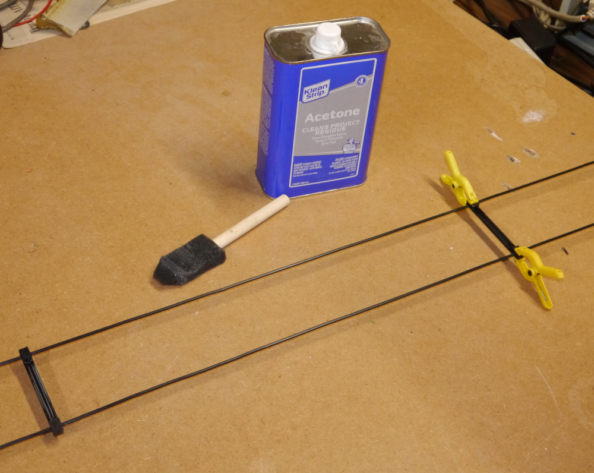

# Open-Wire Transmission Line Construction with 3D-Printed Spacers

This project describes the construction of homemade open-wire transmission line, along with some performance measurements.

Both STL files and the corresponding SolidWorks models are included.

An important caveat:  as of this writing (Sep 2024) I've constructed an initial length of this feedline,
but it hasn't yet been exposed for any significant length of time to UV light and the effects of weather, 
so its long-term reliability is yet to be proven.  
I'll update this page in the future as data becomes available.

## Description

I needed a length of open-wire transmission line to feed a multi-band doublet antenna, and commercially-available options are scarce or non-existent.
I had purchased a 500 ft spool of antenna wire (`DX Engineering DXE-ANTW-500`) for the antenna itself and decided to construct the feedline from the same material.
This is a 14 AWG stranded wire with a UV-resistant PVC jacket.

It appears that this wire is now only available in smaller spools (300, 150, 75 feet).
Some other wire with the same jacket diameter (0.115") would presumably work just as well.

I decided on a wire spacing of 3 inches, with spacers placed every 18 inches, purely for mechanical (or aesthetic?) reasons.
The wire spacing isn't very significant electrically -- practical values all result in characteristic impedancess in the 500 - 600 ohm range.

The spacers are printed from ASA filament, which is similar to ABS but known for its superior UV resistance.  
Some domestic filament manufacturers I've purchased the ASA filament from are [Coex](https://coex3d.com/) and [3DXTech](https://www.3dxtech.com/).
I've included versions which can be assembled using acetone as a solvent,  as well as a version that uses cable ties to attach the wires.

## Models

The models provided in the `\models` directory are:

| | File | Desc |
| :---: | --- | --- |
| 1 | Spreader_3inch_4a.* | 3 inch spreader (for welding with acetone) |
| 2 | Spreader_3inch_4a_1hole.* | ...same, with (1) mounting hole |
| 3 | Spreader_3inch_4a_2hole.* | ...same, with (2) mounting holes |
| 4 | Spreader_3inch_4b.* | Wire clips for above parts (2 per spreader) |
| 5 | Spreader_3inch_6.* | Version for assembly with wire ties |

Material cost per spacer is approximately $0.08.

## Assembly

The wire clips attach the wires to the spacer as shown above.  As produced on my printer, the clips snap firmly onto the spacers.
If this isn't the case for your equipment, most (all?) 3D printing software will allow you to scale the model to be printed, allowing you
to obtain a tight fit.

I began by attaching the two wires to the center insulator I'll be using for the antenna, and stretching them tight using a bungie cord at the other end.

Press the spacer onto the wires and apply a generous amount of acetone to all the mating surfaces before inserting the clips.
The only problems I experienced were the result of being too stingy with the acetone.
I used some cheap spring clamps (Harbor Freight, etc.) to hold things in place although I doubt this is necessary.

After an hour or so the parts will have formed an extremely strong bond. The examples I've tested are impossible to pull apart manually.

I've also included a spacer for use with wire ties (the ones I used are 2.5 x 98mm).

## Performance

I suspended a 66-foot-long section of transmission line in my workshop, without bends and separated by several feet from other objects, 
and performed various measurements:

### Velocity factor
Using my VNA and a balun, I observed the frequencies of the nulls that appear at odd multiples of a quarter wavelength.

| Freq (MHz) | WL | Implied electrical length (ft) |
| --- | --- | --- |
| 3.546 | 1/4 $\lambda$ | 69.344 |
| 10.5729 | 3/4 $\lambda$ | 69.771 |
| 17.675 | 5/4 $\lambda$ | 69.559 |
| 24.780 | 7/4 $\lambda$ | 69.461 |

Averaging these results, we get a velocity factor of $VF = 66.0 / 69.531 = 0.949$ 
and an effective dielectric constant of $\epsilon$r $= 1/VF^2 = 1.110$

### Characteristic impedance

Using the equation for $Z_o$ in free space, and the spacing and diameter of our wires:

$Z_o = 119.92 cosh^-1(3 / 0.0641) = 544.3 \Omega$

## Disclaimer
You access to and use the contents of this site at your own risk.\
The author assumes no responsibility or liability for any errors or omissions in the content of this site.\
The information and models provided on this site are provided in good faith, however we make no representation  or warranty of any kind,
express or implied, regarding the accuracy, adequacy,  validity, reliability, or completeness of any information on the site.

## Contact
ac8p@proton.me

